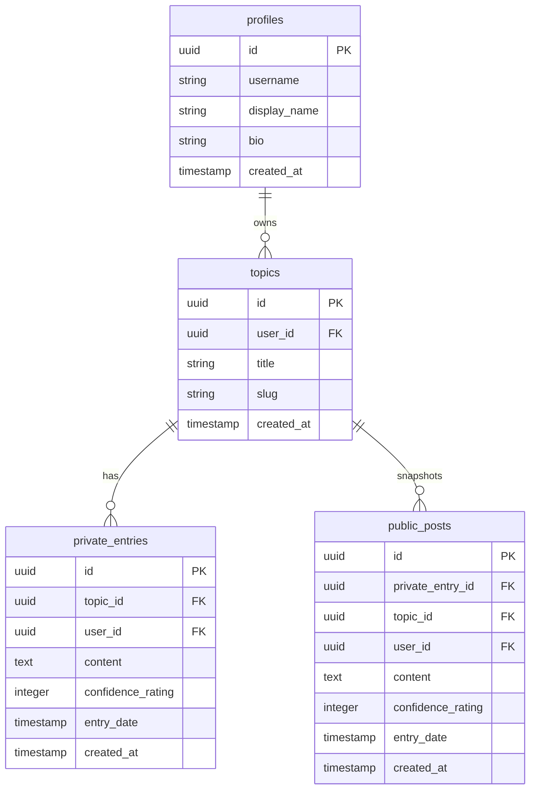

# Throughline: System Specification & Technical Blueprint

This document serves as the comprehensive technical specification and implementation blueprint for **Throughline**—a slow-social/journaling platform where users document their evolving thoughts and selectively share them.

---

## 1. Product Overview & Key Workflows

### 1.1 Core Concepts
* **Topic (Throughline):** A central theme or question a user is contemplating (e.g., "Universal basic income", "Raising bilingual kids").
* **Entry:** A single point in time update to a Topic. Contains text, timestamp, and visibility status.
* **Confidence Rating:** A numeric scale (0–100) representing how strongly the user believes in their statement at that moment, plotted as an evolutionary line graph.
* **Visibility:** 
  * `Private`: Accessible only to the author.
  * `Public`: Published to the user's public profile and discoverable by others.

### 1.2 User Workflows
1. **Onboarding:** Sign up/in via email or Google.
2. **Journaling (Private):** Create a Topic, add thoughts over days/months/years, adjust the belief slider.
3. **Publishing:** Toggle individual entries (or the whole timeline) to `Public`.
4. **Discovering:** Browse public throughlines, follow creators, nudge creators for updates on specific topics.

---

## 2. Technical Stack

| Layer | Technology | Rationale |
| :--- | :--- | :--- |
| **Frontend** | React (Vite) + TailwindCSS | Rapid development, fast builds, responsive rendering, component-driven architecture. |
| **Icons & Fonts** | Lucide React + Google Fonts | Minimalist icon set. Typography: *Fraunces* (editorial/serif) and *Public Sans* (clean/sans-serif). |
| **Backend & DB** | Supabase (PostgreSQL) | Native PostgreSQL power, built-in Auth, Row-Level Security (RLS), and Serverless Edge Functions. |
| **Hosting** | Vercel (Frontend) + Supabase (Database & API) | Fast CDN deployment, automatic SSL, and seamless branch previews. |

---

## 3. Database Architecture (PostgreSQL Schema)

To enforce strict security and prevent leaks of private thoughts, we use **Dual-Table Isolation** for entries, backed by **PostgreSQL Row-Level Security (RLS)**.



### 3.1 Table DDL Definitions

```sql
-- Enable UUID extension
create extension if not exists "uuid-ossp";

-- 1. PROFILES TABLE (Linked to Supabase Auth)
create table public.profiles (
    id uuid references auth.users on delete cascade primary key,
    username text unique not null check (char_length(username) >= 3),
    display_name text,
    bio text,
    avatar_url text,
    created_at timestamp with time zone default timezone('utc'::text, now()) not null,
    constraint username_format check (username ~* '^[a-zA-Z0-9_]+$')
);

-- 2. TOPICS (THROUGHLINES) TABLE
create table public.topics (
    id uuid default gen_random_uuid() primary key,
    user_id uuid references public.profiles(id) on delete cascade not null,
    title text not null check (char_length(title) <= 150),
    slug text not null,
    created_at timestamp with time zone default timezone('utc'::text, now()) not null,
    constraint unique_user_topic_slug unique (user_id, slug)
);

-- 3. PRIVATE JOURNAL ENTRIES TABLE
create table public.private_entries (
    id uuid default gen_random_uuid() primary key,
    topic_id uuid references public.topics(id) on delete cascade not null,
    user_id uuid references public.profiles(id) on delete cascade not null,
    content text not null,
    confidence_rating integer check (confidence_rating >= 0 and confidence_rating <= 100),
    entry_date timestamp with time zone default timezone('utc'::text, now()) not null,
    created_at timestamp with time zone default timezone('utc'::text, now()) not null
);

-- 4. PUBLIC POSTS TABLE (Discover / Public Profile Feed)
create table public.public_posts (
    id uuid default gen_random_uuid() primary key,
    private_entry_id uuid references public.private_entries(id) on delete cascade unique not null,
    topic_id uuid references public.topics(id) on delete cascade not null,
    user_id uuid references public.profiles(id) on delete cascade not null,
    content text not null,
    confidence_rating integer check (confidence_rating >= 0 and confidence_rating <= 100),
    entry_date timestamp with time zone default timezone('utc'::text, now()) not null,
    created_at timestamp with time zone default timezone('utc'::text, now()) not null,
    moderation_status text default 'pending' check (moderation_status in ('pending', 'approved', 'flagged')) not null
);
```

---

## 4. Authentication, Authorization & Security Measures

### 4.1 Authentication Flow
* **Provider:** Supabase Auth using JWT (JSON Web Tokens).
* **Token Storage:** Stored securely by the Supabase client library in browser `localStorage`.
* **JWT Claims:** Each API request carries an `Authorization: Bearer <JWT>` header containing the user's encrypted identity (`uid`).

### 4.2 Row-Level Security (RLS) Policies
PostgreSQL RLS ensures that users can never access or modify data belonging to another user.

```sql
-- Enable RLS on all tables
alter table public.profiles enable row level security;
alter table public.topics enable row level security;
alter table public.private_entries enable row level security;
alter table public.public_posts enable row level security;

-- PROFILES POLICIES
create policy "Allow public read access to profiles" on public.profiles
    for select using (true);

create policy "Allow users to update their own profile" on public.profiles
    for update using (auth.uid() = id);

-- TOPICS POLICIES
create policy "Allow public read access to topics" on public.topics
    for select using (true); -- Topics themselves are public categories; entries dictate visibility.

create policy "Allow authenticated users to insert topics" on public.topics
    for insert with check (auth.uid() = user_id);

create policy "Allow owners to update/delete their topics" on public.topics
    for all using (auth.uid() = user_id);

-- PRIVATE ENTRIES POLICIES (Strict Lockdown)
create policy "Restrict private entries to owner only" on public.private_entries
    for all using (auth.uid() = user_id);

-- PUBLIC POSTS POLICIES
create policy "Allow public read access to approved posts" on public.public_posts
    for select using (moderation_status = 'approved');

create policy "Allow owners to read their own pending/flagged posts" on public.public_posts
    for select using (auth.uid() = user_id);

create policy "Allow owners to insert public posts" on public.public_posts
    for insert with check (auth.uid() = user_id);

create policy "Allow owners to delete public posts" on public.public_posts
    for delete using (auth.uid() = user_id);
```

### 4.3 Data Encryption (At-Rest and In-Transit)
* **In-Transit:** HTTPS strictly enforced via HSTS header parameters.
* **At-Rest (App level):** Encryption at rest for data storage drives. `private_entries.content` can also optionally be encrypted using `pgsodium` extension client keys for end-to-end security options.

---

## 5. API Design & Serverless Edge Functions

Instead of a monolithic backend server, the API layer is handled via **Supabase Edge Functions** (TypeScript/Deno) and direct database client-to-DB connections validated by RLS.

### 5.1 Public APIs (Edge Functions)

#### A. Publishing an Entry (`POST /functions/v1/publish-post`)
Copies a `private_entries` record to `public_posts` and triggers the moderation pipeline.
* **Headers:** `Authorization: Bearer <JWT>`
* **Payload:**
  ```json
  {
    "private_entry_id": "uuid-string"
  }
  ```
* **Process Flow:**
  1. Authorize JWT claim matching `user_id` of the private entry.
  2. Perform an atomic upsert into `public_posts`.
  3. Invoke the Asynchronous Moderation Webhook.

#### B. Moderation Webhook (`POST /functions/v1/moderate-post`)
* **Trigger:** Triggered automatically via Database Webhook when a new row is added to `public_posts`.
* **Process Flow:**
  1. Read post content.
  2. Send payload to AI moderation API (e.g., Perspective API / Llama Guard).
  3. If safe: Update `public_posts.moderation_status` to `'approved'`.
  4. If unsafe: Update `public_posts.moderation_status` to `'flagged'`.

---

## 6. Client Routing & URL Specifications

To ensure search engine optimization (SEO) and user shareability, client-side routing must map to clean, readable URL structures.

```
/                         -> Landing Page / Auth (Login & Signup modal)
/discover                 -> Global Feed (Approved public entries)
/dashboard                -> App dashboard (List of user's personal throughlines)
/dashboard/topic/:id      -> Deep dive into a single topic timeline
/settings                 -> Profile and security configurations
/:username                -> Public profile page (User bio + public topics)
/:username/:topic-slug    -> Public view of a specific throughline timeline
```

* **Router:** React Router v6 DOM.
* **Dynamic Slugs:** Slugs must be generated using lowercase alphanumeric characters and hyphens (e.g., `universal-basic-income`).

---

## 7. Frontend Architecture & State Management

```
src/
├── assets/             # Global styles, typography configurations
├── components/         # Shared UI (Button, Input, Card, Modal)
│   ├── layout/         # Navigation, Sidebar, Footer
│   ├── throughline/    # Timeline Component, EntryDot, BeliefSlider
│   └── feedback/       # Toast notifications, Skeletal loaders
├── context/            # AuthContext (Supabase Auth Session state)
├── hooks/              # Custom React Query / Fetching hooks
├── pages/              # Router Page Components
└── utils/              # Slug generators, formatting helpers, client initialization
```

### Key UI Features to Implement:
1. **Belief Slider:** Custom-styled slider range input representing confidence (0–100).
2. **Timeline Spine:** Vertical line that connects entry nodes. Uses CSS dashed/solid lines based on transition states.
3. **Draft Cache:** Save draft entries to `localStorage` locally to prevent data loss due to connection drops before database insertion.

---

## 8. Verification & QA Plan

### 8.1 Automated Testing
* **Database Unit Tests:** Write pgTap SQL scripts to assert RLS policies prevent unauthorized reads/writes.
* **Frontend E2E Tests:** Playwright tests to verify the authentication flows, draft creation, and publishing flows.

### 8.2 Security Audit Items
* Check that **no API endpoint** exposes `private_entries` data to non-owners.
* Validate that inputs are properly sanitized against XSS before being rendered in the timeline.
